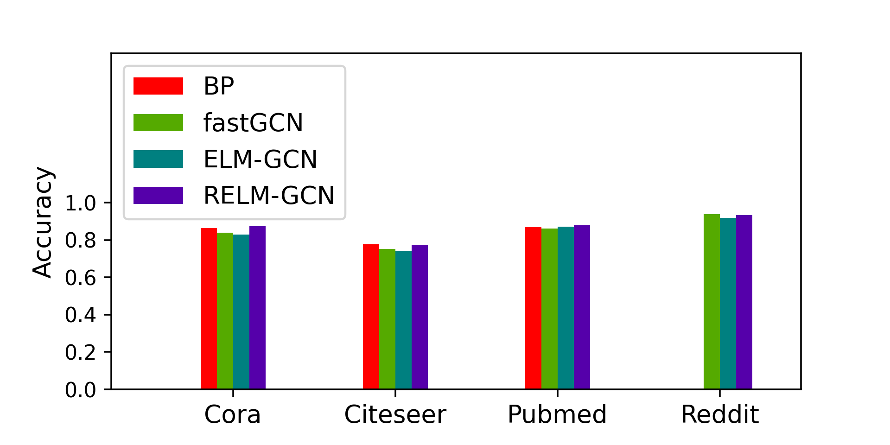
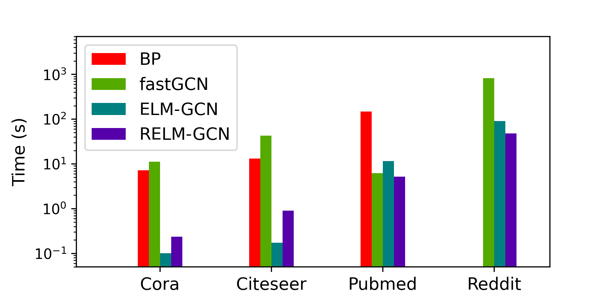
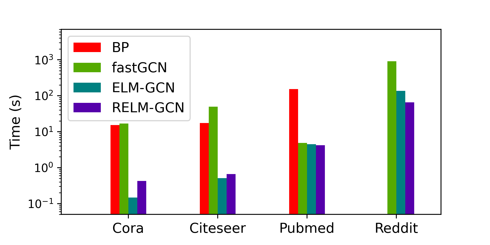

# ELM-GCN

Graph Convolutional Network (GCN) is a powerful model to deal with data arranged as a graph, a structured non-euclidian domain. It is known that GCN reaches high accuracy even when operating with just 2 layers. Another well-known result shows that Extreme Learning Machine (ELM) is an efficient analytic learning technique to train 2 layers Multi-Layer Perceptron (MLP). In this work, we extend ELM theory to operate in the context of GCN, giving rise to ELM-GCN, a novel learning mechanism to train GCN that turns out to be faster than baseline techniques while maintaining prediction capability. We also show a theoretical upper bound in the number of hidden units required to guarantee the GCN performance. To the best of our knowledge, our approach is the first to provide such theoretical guarantees while proposing a non-iterative learning algorithm to train graph convolutional networks.

Since the dataset's sizes are large, we could not upload it to GitHub. However, as discussed in the published paper, the datasets can be obtained in the refered links. We alos provide them ready-to-use in:
https://drive.google.com/drive/u/9/folders/1OiYjogJyrThXgkoleuzRVZ_C5ZtPNTg3

Our pre-processed Reddit data in latter url was prepared using steps showed in this document and matches processed original Reddit data.
